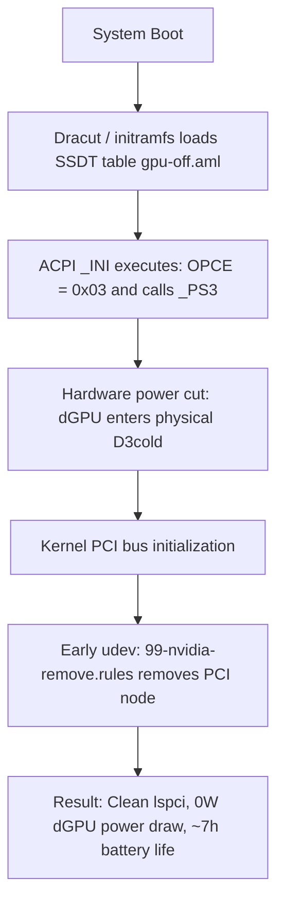

# ⚡ Lenovo Legion 5 Pro (82JQ) — NVIDIA dGPU Hard Power-Off

> Hardware-level power cutoff (D3cold) for the dedicated NVIDIA GPU on **Lenovo Legion 5 Pro 16ACH6H (Type 82JQ)** running Linux. Achieves 0W dGPU power draw and extends battery life from ~1.5h to 6–8h.

[ 🇬🇧 English ](README.md) • [ 🇵🇱 Polski ](README.pl.md)

---

[-crimson)](https://github.com/patientone-io/legion-nvidia-off)
[](https://github.com/patientone-io/legion-nvidia-off)
[](LICENSE)

---

## ⚠️ Target Hardware & Limitations

> [!IMPORTANT]
> **TESTED EXCLUSIVELY ON MODEL 82JQ**  
> This patch was engineered, tested, and verified **exclusively on the Lenovo Legion 5 Pro 16ACH6H (Model/Type: 82JQ)** featuring AMD Ryzen 7 5800H and NVIDIA GeForce RTX 3060/3070.  
> Other Legion generations, Intel-based variants, or different motherboard revisions may use a different ACPI device hierarchy (e.g., not `\_SB.PCI0.GPP0.PEGP`) or different power-gating variables. **Do not use this on different laptop models without verifying your ACPI DSDT tables first.**

> [!WARNING]
> **EXTERNAL DISPLAYS (HDMI & USB-C DP)**  
> On the Legion 5 Pro (16ACH6H), the physical HDMI port and rear USB-C DisplayPort alternate-mode pins are **hardwired directly to the NVIDIA dGPU**.  
> When the dGPU is powered off, **external monitors connected to these ports will receive no signal**. The internal laptop display (eDP) is connected directly to the AMD Radeon iGPU and works with full refresh rate and brightness control. USB DisplayLink adapters are unaffected.

---

## 🔍 Why Standard Linux Tools Fail on Legion

On hybrid laptops, disabling the dedicated GPU under Linux usually falls into one of these traps:

1. **`envycontrol -s integrated` or manual udev remove:**  
   EnvyControl blacklists kernel modules and writes `1` to `/sys/bus/pci/devices/.../remove`. However, on Lenovo Legion firmware, unbinding the driver or removing the device from the PCI bus leaves the physical chip in an unmanaged **D0 state**. The card remains powered on and continues drawing **15W–25W**, draining the battery in less than 2 hours.
2. **`bbswitch`:**  
   Deprecated and non-functional on modern Linux kernels and Ampere/Ada Lovelace architectures.
3. **`acpi_call` (DKMS):**  
   Runs late in userspace, breaks with every minor kernel update, and frequently causes kernel panics or ACPI timeouts during suspend/resume.

### The Fix: OEM Variable Override (`OPCE = 0x03`)

In Lenovo's DSDT ACPI tables, the dGPU power state method `_PS3` is guarded by an internal variable:

```asl
Method (_PS3, 0, NotSerialized)
{
    If (LEqual (OPCE, 0x03))
    {
        _OFF ()
        Store (0x02, OPCE)
    }
    Store (0x03, _PSC)
}
```

If `OPCE` does not equal `0x03`, calling `_PS3()` **does not execute `_OFF()`**, and the hardware power gate never triggers.

This project supplies a compiled ACPI SSDT table loaded during early boot ([`CONFIG_ACPI_TABLE_UPGRADE`](https://www.kernel.org/doc/html/latest/admin-guide/acpi/ssdt-overlays.html)) that executes on device initialization (`_INI`):

```asl
DefinitionBlock ("", "SSDT", 2, "L5Pro", "NvidiaOf", 0x00001000)
{
    External (_SB_.PCI0.GPP0.PEGP, DeviceObj)
    External (_SB_.PCI0.GPP0.PEGP._PS3, MethodObj)
    External (_SB_.PCI0.GPP0.PEGP.OPCE, IntObj)

    Scope (\_SB.PCI0.GPP0.PEGP)
    {
        Method (_INI, 0, NotSerialized)
        {
            \_SB.PCI0.GPP0.PEGP.OPCE = 0x03
            _PS3 ()
        }
    }
}
```

---

## 🏗️ Execution Workflow



1. **ACPI Early Boot:** Initramfs loads `gpu-off.aml` before kernel driver probing. ACPI sets `OPCE = 0x03` and cuts power to the dGPU (**D3cold**).
2. **Udev PCI Cleanup:** Early udev rule sends `ATTR{remove}="1"`, unregistering the unpowered NVIDIA node so the kernel never polls or wakes it.
3. **Module Blacklisting:** Modprobe and kernel parameters prevent `nvidia`, `nouveau`, and related modules from loading.

---

## 🗺️ System File Mapping

| Repository File | Target System Path | Distribution | Role |
| :--- | :--- | :--- | :--- |
| `common/gpu-off.dsl` | *(Compiles to `.aml`)* | All | ACPI Source code overriding power state |
| `common/gpu-off.aml` | `/etc/dracut.conf.d/acpi/gpu-off.aml` | Arch / Fedora | Precompiled SSDT table loaded by Dracut |
| `common/gpu-off.aml` | `/var/lib/acpi-override/gpu-off.aml` | Debian / Ubuntu | Precompiled SSDT for `acpi-override-initramfs` |
| `common/blacklist-nvidia.conf` | `/etc/modprobe.d/blacklist-nvidia.conf` | All | Kernel module blacklist |
| `common/99-nvidia-remove.rules` | `/etc/udev/rules.d/99-nvidia-remove.rules` | All | Udev rule removing dead dGPU node from PCI bus |
| `distros/arch-dracut/gpu-kill.conf` | `/etc/dracut.conf.d/gpu-kill.conf` | Arch Linux | Dracut override flags (`acpi_override="yes"`) |
| `distros/fedora-dracut/gpu-kill.conf` | `/etc/dracut.conf.d/gpu-kill.conf` | Fedora | Dracut override flags (`acpi_override="yes"`) |
| `distros/debian-initramfs/gpu-kill` | `/etc/initramfs-tools/hooks/gpu-kill` | Debian / Ubuntu | Hook bundling udev rule into initramfs |

---

## 🚀 Automated Installation

Clone the repository and run the installer:

```bash
git clone https://github.com/patientone-io/legion-nvidia-off.git
cd legion-nvidia-off
sudo ./install.sh
sudo reboot
```

*The installer verifies DMI product name and version (`82JQ` / `16ACH6H`), installs the configs, compiles the ACPI table if needed, rebuilds initramfs, and updates bootloader entries.*

---

## 📖 Manual Installation (Step by Step)

If you prefer doing it by hand:

### Step 1: Install ACPI Compiler
* **Arch / EndeavourOS:** `sudo pacman -S --needed acpica`
* **Fedora:** `sudo dnf install -y acpica-tools`
* **Debian / Ubuntu:** `sudo apt update && sudo apt install -y acpica-tools acpi-override-initramfs`

### Step 2: Compile ACPI SSDT
```bash
iasl -tc common/gpu-off.dsl
```

### Step 3: Install Common Rules
```bash
sudo install -Dm644 common/blacklist-nvidia.conf /etc/modprobe.d/blacklist-nvidia.conf
sudo install -Dm644 common/99-nvidia-remove.rules /etc/udev/rules.d/99-nvidia-remove.rules
```

---

### Step 4A: Arch Linux / EndeavourOS (Dracut)

1. **Install ACPI table and Dracut configuration:**
   ```bash
   sudo mkdir -p /etc/dracut.conf.d/acpi
   sudo cp common/gpu-off.aml /etc/dracut.conf.d/acpi/gpu-off.aml
   sudo cp distros/arch-dracut/gpu-kill.conf /etc/dracut.conf.d/gpu-kill.conf
   ```
2. **Add blacklist parameters to kernel cmdline (`/etc/kernel/cmdline`):**
   ```text
   rd.driver.blacklist=nouveau,nvidia,nvidia_drm,nvidia_modeset modprobe.blacklist=nouveau,nvidia,nvidia_drm,nvidia_modeset systemd.mask=nvidia-fallback.service
   ```
3. **Rebuild initramfs and refresh kernels:**
   ```bash
   sudo dracut-rebuild || sudo dracut -f --regenerate-all
   sudo reinstall-kernels # (if using systemd-boot on EndeavourOS)
   ```

---

### Step 4B: Fedora (Dracut + Grubby)

1. **Install ACPI table and Dracut config:**
   ```bash
   sudo mkdir -p /etc/dracut.conf.d/acpi
   sudo cp common/gpu-off.aml /etc/dracut.conf.d/acpi/gpu-off.aml
   sudo cp distros/fedora-dracut/gpu-kill.conf /etc/dracut.conf.d/gpu-kill.conf
   ```
2. **Apply kernel arguments via `grubby`:**
   ```bash
   sudo grubby --update-kernel=ALL --args="rd.driver.blacklist=nouveau,nvidia,nvidia_drm,nvidia_modeset modprobe.blacklist=nouveau,nvidia,nvidia_drm,nvidia_modeset systemd.mask=nvidia-fallback.service"
   ```
3. **Rebuild initramfs:**
   ```bash
   sudo dracut -f --regenerate-all
   ```

---

### Step 4C: Debian / Ubuntu (initramfs-tools)

1. **Install ACPI table to override path:**
   ```bash
   sudo mkdir -p /var/lib/acpi-override
   sudo cp common/gpu-off.aml /var/lib/acpi-override/gpu-off.aml
   ```
2. **Install initramfs hook:**
   ```bash
   sudo install -Dm755 distros/debian-initramfs/gpu-kill /etc/initramfs-tools/hooks/gpu-kill
   ```
3. **Append kernel parameters in `/etc/default/grub`:**
   Add to `GRUB_CMDLINE_LINUX_DEFAULT`:
   ```text
   rd.driver.blacklist=nouveau,nvidia,nvidia_drm,nvidia_modeset modprobe.blacklist=nouveau,nvidia,nvidia_drm,nvidia_modeset systemd.mask=nvidia-fallback.service
   ```
4. **Rebuild and update:**
   ```bash
   sudo update-initramfs -u -k all
   sudo update-grub
   ```

---

## 🔍 Verification After Reboot

Reboot your machine (`sudo reboot`) and run:

```bash
# 1. The NVIDIA GPU should not appear on the PCI bus:
lspci | grep -i nvidia

# 2. Reading PCI power state should return no device:
cat /sys/bus/pci/devices/0000:01:00.0/power_state 2>/dev/null || echo "dGPU is completely powered off and unmapped."
```

Check battery drain using `powertop` or `upower` — baseline idle discharge on the Legion 5 Pro drops to **~6W–9W** (depending on screen brightness).

---

## ⏪ Uninstallation

To restore original factory power behavior and re-enable the NVIDIA dGPU:

```bash
sudo ./uninstall.sh
sudo reboot
```

---

## 📬 Author & Contact

* **Author:** `patientone` ([GitHub](https://github.com/patientone-io))
* **Contact:** `contact@patientone.uk`
* **License:** [MIT](LICENSE)
