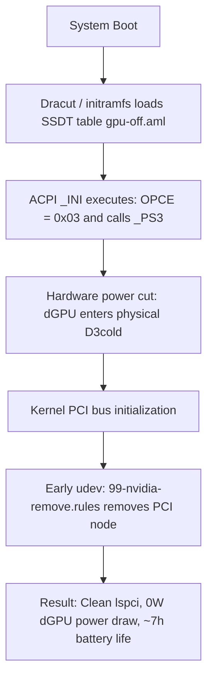
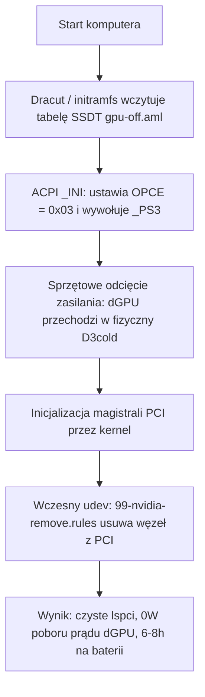

# ⚡ legion-nvidia-off

> 🔋 Hardware-level power cutoff (D3cold) for NVIDIA dGPU on **Lenovo Legion 5 Pro 16ACH6H (Type 82JQ)** running Linux. Achieves 0W dGPU draw and extends battery life from ~1.5h to 6–8h.
>
> 🇵🇱 Sprzętowe odcięcie zasilania dedykowanej karty NVIDIA (stan D3cold) dla **Lenovo Legion 5 Pro 16ACH6H (Model 82JQ)** pod Linuksem. 0W poboru dGPU i praca na baterii do 6–8h.

[ 🇬🇧 English ](#-english) • [ 🇵🇱 Polski ](#-polski)

---

## 🇬🇧 English

[-crimson)](https://github.com/patientone-io/legion-nvidia-off)
[](https://github.com/patientone-io/legion-nvidia-off)
[](LICENSE)

### ⚠️ Target Hardware & Limitations

> [!IMPORTANT]
> **TESTED EXCLUSIVELY ON MODEL 82JQ**  
> This patch was engineered, tested, and verified **exclusively on the Lenovo Legion 5 Pro 16ACH6H (Model/Type: 82JQ)** featuring AMD Ryzen 7 5800H and NVIDIA GeForce RTX 3060/3070.  
> Other Legion generations, Intel-based variants, or different motherboard revisions may use a different ACPI device hierarchy (e.g., not `\_SB.PCI0.GPP0.PEGP`) or different power-gating variables. **Do not use this on different laptop models without verifying your ACPI DSDT tables first.**

> [!WARNING]
> **EXTERNAL DISPLAYS (HDMI & USB-C DP)**  
> On the Legion 5 Pro (16ACH6H), the physical HDMI port and rear USB-C DisplayPort alternate-mode pins are **hardwired directly to the NVIDIA dGPU**.  
> When the dGPU is powered off, **external monitors connected to these ports will receive no signal**. The internal laptop display (eDP) is connected directly to the AMD Radeon iGPU and works with full refresh rate and brightness control. USB DisplayLink adapters are unaffected.

### 🔍 Why Standard Linux Tools Fail on Legion

On hybrid laptops, disabling the dedicated GPU under Linux usually falls into one of these traps:

1. **`envycontrol -s integrated` or manual udev remove:**  
   EnvyControl blacklists kernel modules and writes `1` to `/sys/bus/pci/devices/.../remove`. However, on Lenovo Legion firmware, unbinding the driver or removing the device from the PCI bus leaves the physical chip in an unmanaged **D0 state**. The card remains powered on and continues drawing **15W–25W**, draining the battery in less than 2 hours.
2. **`bbswitch`:**  
   Deprecated and non-functional on modern Linux kernels and Ampere/Ada Lovelace architectures.
3. **`acpi_call` (DKMS):**  
   Runs late in userspace, breaks with every minor kernel update, and frequently causes kernel panics or ACPI timeouts during suspend/resume.

#### The Fix: OEM Variable Override (`OPCE = 0x03`)

In Lenovo's DSDT ACPI tables, the dGPU power state method `_PS3` is guarded by an internal variable:

```asl
Method (_PS3, 0, NotSerialized)
{
    If (LEqual (OPCE, 0x03))
    {
        _OFF ()
        Store (0x02, OPCE)
    }
    Store (0x03, _PSC)
}
```

If `OPCE` does not equal `0x03`, calling `_PS3()` **does not execute `_OFF()`**, and the hardware power gate never triggers.

This project supplies a compiled ACPI SSDT table loaded during early boot ([`CONFIG_ACPI_TABLE_UPGRADE`](https://www.kernel.org/doc/html/latest/admin-guide/acpi/ssdt-overlays.html)) that executes on device initialization (`_INI`):

```asl
DefinitionBlock ("", "SSDT", 2, "L5Pro", "NvidiaOf", 0x00001000)
{
    External (_SB_.PCI0.GPP0.PEGP, DeviceObj)
    External (_SB_.PCI0.GPP0.PEGP._PS3, MethodObj)
    External (_SB_.PCI0.GPP0.PEGP.OPCE, IntObj)

    Scope (\_SB.PCI0.GPP0.PEGP)
    {
        Method (_INI, 0, NotSerialized)
        {
            \_SB.PCI0.GPP0.PEGP.OPCE = 0x03
            _PS3 ()
        }
    }
}
```

### 🏗️ Execution Workflow



1. **ACPI Early Boot:** Initramfs loads `gpu-off.aml` before kernel driver probing. ACPI sets `OPCE = 0x03` and cuts power to the dGPU (**D3cold**).
2. **Udev PCI Cleanup:** Early udev rule sends `ATTR{remove}="1"`, unregistering the unpowered NVIDIA node so the kernel never polls or wakes it.
3. **Module Blacklisting:** Modprobe and kernel parameters prevent `nvidia`, `nouveau`, and related modules from loading.

### 🗺️ System File Mapping

| Repository File | Target System Path | Distribution | Role |
| :--- | :--- | :--- | :--- |
| `common/gpu-off.dsl` | *(Compiles to `.aml`)* | All | ACPI Source code overriding power state |
| `common/gpu-off.aml` | `/etc/dracut.conf.d/acpi/gpu-off.aml` | Arch / Fedora | Precompiled SSDT table loaded by Dracut |
| `common/gpu-off.aml` | `/var/lib/acpi-override/gpu-off.aml` | Debian / Ubuntu | Precompiled SSDT for `acpi-override-initramfs` |
| `common/blacklist-nvidia.conf` | `/etc/modprobe.d/blacklist-nvidia.conf` | All | Kernel module blacklist |
| `common/99-nvidia-remove.rules` | `/etc/udev/rules.d/99-nvidia-remove.rules` | All | Udev rule removing dead dGPU node from PCI bus |
| `distros/arch-dracut/gpu-kill.conf` | `/etc/dracut.conf.d/gpu-kill.conf` | Arch Linux | Dracut override flags (`acpi_override="yes"`) |
| `distros/fedora-dracut/gpu-kill.conf` | `/etc/dracut.conf.d/gpu-kill.conf` | Fedora | Dracut override flags (`acpi_override="yes"`) |
| `distros/debian-initramfs/gpu-kill` | `/etc/initramfs-tools/hooks/gpu-kill` | Debian / Ubuntu | Hook bundling udev rule into initramfs |

### 🚀 Automated Installation

Clone the repository and run the installer:

```bash
git clone https://github.com/patientone-io/legion-nvidia-off.git
cd legion-nvidia-off
sudo ./install.sh
sudo reboot
```

### 📖 Manual Installation (Step by Step)

#### Step 1: Install ACPI Compiler
* **Arch / EndeavourOS:** `sudo pacman -S --needed acpica`
* **Fedora:** `sudo dnf install -y acpica-tools`
* **Debian / Ubuntu:** `sudo apt update && sudo apt install -y acpica-tools acpi-override-initramfs`

#### Step 2: Compile ACPI SSDT
```bash
iasl -tc common/gpu-off.dsl
```

#### Step 3: Install Common Rules
```bash
sudo install -Dm644 common/blacklist-nvidia.conf /etc/modprobe.d/blacklist-nvidia.conf
sudo install -Dm644 common/99-nvidia-remove.rules /etc/udev/rules.d/99-nvidia-remove.rules
```

#### Step 4A: Arch Linux / EndeavourOS (Dracut)
```bash
sudo mkdir -p /etc/dracut.conf.d/acpi
sudo cp common/gpu-off.aml /etc/dracut.conf.d/acpi/gpu-off.aml
sudo cp distros/arch-dracut/gpu-kill.conf /etc/dracut.conf.d/gpu-kill.conf

# Add to /etc/kernel/cmdline:
# rd.driver.blacklist=nouveau,nvidia,nvidia_drm,nvidia_modeset modprobe.blacklist=nouveau,nvidia,nvidia_drm,nvidia_modeset systemd.mask=nvidia-fallback.service

sudo dracut-rebuild || sudo dracut -f --regenerate-all
sudo reinstall-kernels # (if using systemd-boot on EndeavourOS)
```

#### Step 4B: Fedora (Dracut + Grubby)
```bash
sudo mkdir -p /etc/dracut.conf.d/acpi
sudo cp common/gpu-off.aml /etc/dracut.conf.d/acpi/gpu-off.aml
sudo cp distros/fedora-dracut/gpu-kill.conf /etc/dracut.conf.d/gpu-kill.conf

sudo grubby --update-kernel=ALL --args="rd.driver.blacklist=nouveau,nvidia,nvidia_drm,nvidia_modeset modprobe.blacklist=nouveau,nvidia,nvidia_drm,nvidia_modeset systemd.mask=nvidia-fallback.service"
sudo dracut -f --regenerate-all
```

#### Step 4C: Debian / Ubuntu (initramfs-tools)
```bash
sudo mkdir -p /var/lib/acpi-override
sudo cp common/gpu-off.aml /var/lib/acpi-override/gpu-off.aml
sudo install -Dm755 distros/debian-initramfs/gpu-kill /etc/initramfs-tools/hooks/gpu-kill

# Add parameters to GRUB_CMDLINE_LINUX_DEFAULT in /etc/default/grub, then:
sudo update-initramfs -u -k all
sudo update-grub
```

### 🔍 Verification After Reboot

```bash
# 1. The NVIDIA GPU should not appear on the PCI bus:
lspci | grep -i nvidia

# 2. Reading PCI power state should return no device:
cat /sys/bus/pci/devices/0000:01:00.0/power_state 2>/dev/null || echo "dGPU is completely powered off and unmapped."
```

### ⏪ Uninstallation

```bash
sudo ./uninstall.sh
sudo reboot
```

---

## 🇵🇱 Polski

[-crimson)](https://github.com/patientone-io/legion-nvidia-off)
[](https://github.com/patientone-io/legion-nvidia-off)
[](LICENSE)

### ⚠️ Kompatybilność sprzętowa i ograniczenia

> [!IMPORTANT]
> **PRZETESTOWANE WYŁĄCZNIE NA MODELU 82JQ**  
> Ten patch został opracowany, przetestowany i zweryfikowany **wyłącznie na laptopie Lenovo Legion 5 Pro 16ACH6H (kod modelu: 82JQ)** z procesorem AMD Ryzen 7 5800H i kartą graficzną NVIDIA GeForce RTX 3060/3070.  
> Inne serie Legiona, modele z procesorami Intel lub inne rewizje płyt głównych mogą korzystać z innej ścieżki w drzewie ACPI (np. innej niż `\_SB.PCI0.GPP0.PEGP`) albo innych zmiennych blokujących zasilanie. **Nie stosuj tego rozwiązania w ciemno na innych modelach bez wcześniejszej analizy tabel DSDT.**

> [!WARNING]
> **ZEWNĘTRZNE EKRANY (HDMI oraz USB-C DisplayPort)**  
> W Legionie 5 Pro (16ACH6H) fizyczny port HDMI oraz linie DisplayPort w tylnym gnieździe USB-C są **na stałe podłączone elektrycznie pod układ dGPU NVIDIA**.  
> Fizyczne odcięcie zasilania dGPU oznacza, że **zewnętrzne monitory podłączone bezpośrednio do tych portów nie będą otrzymywać sygnału**. Wbudowana matryca laptopa (eDP) jest podpięta bezpośrednio pod zintegrowaną grafikę AMD Radeon i działa bez przeszkód z pełną częstotliwością odświeżania oraz regulacją jasności. Zewnętrzne ekrany działają wyłącznie przez karty USB DisplayLink.

### 🔍 Dlaczego standardowe narzędzia zawodzą na Legionie?

Typowe próby wyłączenia dGPU pod Linuksem na laptopach Legion z reguły nie dają zamierzonego efektu:

1. **`envycontrol -s integrated` lub ręczne odłączanie w udev:**  
   EnvyControl dodaje moduły jądra do blacklisty (w modprobe) i wysyła `1` do `/sys/bus/pci/devices/.../remove`. Jednak w oprogramowaniu układowym (BIOS/ACPI) Lenovo Legion odłączenie sterownika lub usunięcie urządzenia z magistrali PCI pozostawia kartę w stanie **D0**. Chip nadal pobiera **15–25W**, drenując baterię w półtorej godziny.
2. **`bbswitch`:**  
   Przestarzały moduł, nie działa na współczesnych kernelach ani na architekturach Ampere/Ada Lovelace.
3. **`acpi_call` (DKMS):**  
   Działa późno w przestrzeni użytkownika, sypie się po aktualizacjach jądra i często blokuje wybudzanie po uśpieniu (suspend/resume).

#### Rozwiązanie: Zmienna OEM (`OPCE = 0x03`)

W tabelach DSDT Lenovo Legion metoda zarządzania energią `_PS3` jest chroniona warunkiem sprawdzającym zmienną `OPCE`:

```asl
Method (_PS3, 0, NotSerialized)
{
    If (LEqual (OPCE, 0x03))
    {
        _OFF ()
        Store (0x02, OPCE)
    }
    Store (0x03, _PSC)
}
```

Jeśli `OPCE` nie ma wartości `0x03`, wywołanie `_PS3()` **w ogóle nie uruchamia procedury `_OFF()`**, a zasilanie karty pozostaje włączone.

To repozytorium dostarcza skompilowaną tabelę SSDT wstrzykiwaną na wczesnym etapie bootowania ([`CONFIG_ACPI_TABLE_UPGRADE`](https://www.kernel.org/doc/html/latest/admin-guide/acpi/ssdt-overlays.html)), która wykonuje się podczas inicjalizacji urządzenia (`_INI`):

```asl
DefinitionBlock ("", "SSDT", 2, "L5Pro", "NvidiaOf", 0x00001000)
{
    External (_SB_.PCI0.GPP0.PEGP, DeviceObj)
    External (_SB_.PCI0.GPP0.PEGP._PS3, MethodObj)
    External (_SB_.PCI0.GPP0.PEGP.OPCE, IntObj)

    Scope (\_SB.PCI0.GPP0.PEGP)
    {
        Method (_INI, 0, NotSerialized)
        {
            \_SB.PCI0.GPP0.PEGP.OPCE = 0x03
            _PS3 ()
        }
    }
}
```

### 🏗️ Przebieg bootowania



### 🗺️ Mapa plików w systemie

| Plik w repozytorium | Ścieżka docelowa w systemie | Dystrybucja | Rola pliku |
| :--- | :--- | :--- | :--- |
| `common/gpu-off.dsl` | *(Kompilowany do `.aml`)* | Wszystkie | Źródło ACPI ASL ze zmienną OPCE |
| `common/gpu-off.aml` | `/etc/dracut.conf.d/acpi/gpu-off.aml` | Arch / Fedora | Tabela SSDT wczytywana przez Dracuta |
| `common/gpu-off.aml` | `/var/lib/acpi-override/gpu-off.aml` | Debian / Ubuntu | Tabela SSDT dla `acpi-override-initramfs` |
| `common/blacklist-nvidia.conf` | `/etc/modprobe.d/blacklist-nvidia.conf` | Wszystkie | Blacklista modułów jądra (modprobe) |
| `common/99-nvidia-remove.rules` | `/etc/udev/rules.d/99-nvidia-remove.rules` | Wszystkie | Reguła udev usuwająca dGPU z szyny PCI |
| `distros/arch-dracut/gpu-kill.conf` | `/etc/dracut.conf.d/gpu-kill.conf` | Arch Linux | Flagi Dracuta (`acpi_override="yes"`) |
| `distros/fedora-dracut/gpu-kill.conf` | `/etc/dracut.conf.d/gpu-kill.conf` | Fedora | Flagi Dracuta (`acpi_override="yes"`) |
| `distros/debian-initramfs/gpu-kill` | `/etc/initramfs-tools/hooks/gpu-kill` | Debian / Ubuntu | Hook dołączający regułę udev do initramfs |

### 🚀 Szybka instalacja automatyczna

```bash
git clone https://github.com/patientone-io/legion-nvidia-off.git
cd legion-nvidia-off
sudo ./install.sh
sudo reboot
```

### 📖 Instrukcja manualna (krok po kroku)

#### Krok 1: Instalacja kompilatora ACPI
* **Arch / EndeavourOS:** `sudo pacman -S --needed acpica`
* **Fedora:** `sudo dnf install -y acpica-tools`
* **Debian / Ubuntu:** `sudo apt update && sudo apt install -y acpica-tools acpi-override-initramfs`

#### Krok 2: Kompilacja tabeli SSDT
```bash
iasl -tc common/gpu-off.dsl
```

#### Krok 3: Kopiowanie wspólnych reguł
```bash
sudo install -Dm644 common/blacklist-nvidia.conf /etc/modprobe.d/blacklist-nvidia.conf
sudo install -Dm644 common/99-nvidia-remove.rules /etc/udev/rules.d/99-nvidia-remove.rules
```

#### Krok 4A: Arch Linux / EndeavourOS (Dracut)
```bash
sudo mkdir -p /etc/dracut.conf.d/acpi
sudo cp common/gpu-off.aml /etc/dracut.conf.d/acpi/gpu-off.aml
sudo cp distros/arch-dracut/gpu-kill.conf /etc/dracut.conf.d/gpu-kill.conf

# Dopisanie do /etc/kernel/cmdline:
# rd.driver.blacklist=nouveau,nvidia,nvidia_drm,nvidia_modeset modprobe.blacklist=nouveau,nvidia,nvidia_drm,nvidia_modeset systemd.mask=nvidia-fallback.service

sudo dracut-rebuild || sudo dracut -f --regenerate-all
sudo reinstall-kernels
```

#### Krok 4B: Fedora (Dracut + Grubby)
```bash
sudo mkdir -p /etc/dracut.conf.d/acpi
sudo cp common/gpu-off.aml /etc/dracut.conf.d/acpi/gpu-off.aml
sudo cp distros/fedora-dracut/gpu-kill.conf /etc/dracut.conf.d/gpu-kill.conf

sudo grubby --update-kernel=ALL --args="rd.driver.blacklist=nouveau,nvidia,nvidia_drm,nvidia_modeset modprobe.blacklist=nouveau,nvidia,nvidia_drm,nvidia_modeset systemd.mask=nvidia-fallback.service"
sudo dracut -f --regenerate-all
```

#### Krok 4C: Debian / Ubuntu (initramfs-tools)
```bash
sudo mkdir -p /var/lib/acpi-override
sudo cp common/gpu-off.aml /var/lib/acpi-override/gpu-off.aml
sudo install -Dm755 distros/debian-initramfs/gpu-kill /etc/initramfs-tools/hooks/gpu-kill

# Dopisanie parametrów do GRUB_CMDLINE_LINUX_DEFAULT w /etc/default/grub, a następnie:
sudo update-initramfs -u -k all
sudo update-grub
```

### 🔍 Weryfikacja po restarcie

```bash
lspci | grep -i nvidia
cat /sys/bus/pci/devices/0000:01:00.0/power_state 2>/dev/null || echo "Karta jest fizycznie wyłączona i usunięta z magistrali."
```

### ⏪ Przywracanie ustawień fabrycznych (odinstalowanie)

```bash
sudo ./uninstall.sh
sudo reboot
```

---

## 👤 Author & Contact / Autor i kontakt

* **Author:** [patientone](https://github.com/patientone-io)
* **Website:** [patientone.uk](https://patientone.uk)
* **Email:** `contact@patientone.uk`

---

## 📄 License / Licencja

* **EN:** Released under the **MIT License**. See [LICENSE](LICENSE) for details.
* **PL:** Projekt udostępniany na licencji **MIT**. Szczegóły w pliku [LICENSE](LICENSE).
