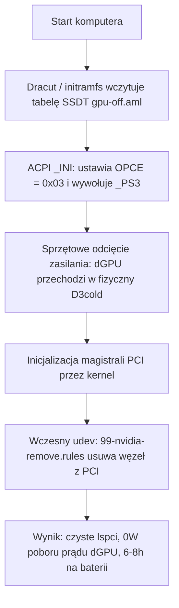

# ⚡ Lenovo Legion 5 Pro (82JQ) — Wyłączenie zasilania dGPU NVIDIA (ACPI Hard Power-Off)

> Sprzętowe odcięcie zasilania dedykowanej karty graficznej NVIDIA (stan D3cold) dla laptopa **Lenovo Legion 5 Pro 16ACH6H (Model: 82JQ)** pod kontrolą Linuksa. Redukuje pobór prądu dGPU do 0W i wydłuża czas pracy na baterii z ~1.5h do 6–8h.

[ 🇬🇧 English ](README.md) • [ 🇵🇱 Polski ](README.pl.md)

---

[-crimson)](https://github.com/patientone-io/legion-nvidia-off)
[](https://github.com/patientone-io/legion-nvidia-off)
[](LICENSE)

---

## ⚠️ Kompatybilność sprzętowa i ograniczenia

> [!IMPORTANT]
> **PRZETESTOWANE WYŁĄCZNIE NA MODELU 82JQ**  
> Ten patch został opracowany, przetestowany i zweryfikowany **wyłącznie na laptopie Lenovo Legion 5 Pro 16ACH6H (kod modelu: 82JQ)** z procesorem AMD Ryzen 7 5800H i kartą graficzną NVIDIA GeForce RTX 3060/3070.  
> Inne serie Legiona, modele z procesorami Intel lub inne rewizje płyt głównych mogą korzystać z innej ścieżki w drzewie ACPI (np. innej niż `\_SB.PCI0.GPP0.PEGP`) albo innych zmiennych blokujących zasilanie. **Nie stosuj tego rozwiązania w ciemno na innych modelach bez wcześniejszej analizy tabel DSDT.**

> [!WARNING]
> **ZEWNĘTRZNE EKRANY (HDMI oraz USB-C DisplayPort)**  
> W Legionie 5 Pro (16ACH6H) fizyczny port HDMI oraz linie DisplayPort w tylnym gnieździe USB-C są **na stałe podłączone elektrycznie pod układ dGPU NVIDIA**.  
> Fizyczne odcięcie zasilania dGPU oznacza, że **zewnętrzne monitory podłączone bezpośrednio do tych portów nie będą otrzymywać sygnału**. Wbudowana matryca laptopa (eDP) jest podpięta bezpośrednio pod zintegrowaną grafikę AMD Radeon i działa bez przeszkód z pełną częstotliwością odświeżania oraz regulacją jasności. Zewnętrzne ekrany działają wyłącznie przez karty USB DisplayLink.

---

## 🔍 Dlaczego standardowe narzędzia zawodzą na Legionie?

Typowe próby wyłączenia dGPU pod Linuksem na laptopach Legion z reguły nie dają zamierzonego efektu:

1. **`envycontrol -s integrated` lub ręczne odłączanie w udev:**  
   EnvyControl nakłada czarną listę modułów i wysyła `1` do `/sys/bus/pci/devices/.../remove`. Jednak w oprogramowaniu układowym (BIOS/ACPI) Lenovo Legion odłączenie sterownika lub usunięcie urządzenia z magistrali PCI pozostawia kartę w stanie **D0**. Chip nadal pobiera **15–25W**, drenując baterię w półtorej godziny.
2. **`bbswitch`:**  
   Przestarzały moduł, nie działa na współczesnych kernelach ani na architekturach Ampere/Ada Lovelace.
3. **`acpi_call` (DKMS):**  
   Działa późno w przestrzeni użytkownika, sypie się po aktualizacjach jądra i często blokuje wybudzanie po uśpieniu (suspend/resume).

### Rozwiązanie: Zmienna OEM (`OPCE = 0x03`)

W tabelach DSDT Lenovo Legion metoda zarządzania energią `_PS3` jest chroniona warunkiem sprawdzającym zmienną `OPCE`:

```asl
Method (_PS3, 0, NotSerialized)
{
    If (LEqual (OPCE, 0x03))
    {
        _OFF ()
        Store (0x02, OPCE)
    }
    Store (0x03, _PSC)
}
```

Jeśli `OPCE` nie ma wartości `0x03`, wywołanie `_PS3()` **w ogóle nie uruchamia procedury `_OFF()`**, a zasilanie karty pozostaje włączone.

To repozytorium dostarcza skompilowaną tabelę SSDT wstrzykiwaną na wczesnym etapie bootowania ([`CONFIG_ACPI_TABLE_UPGRADE`](https://www.kernel.org/doc/html/latest/admin-guide/acpi/ssdt-overlays.html)), która wykonuje się podczas inicjalizacji urządzenia (`_INI`):

```asl
DefinitionBlock ("", "SSDT", 2, "L5Pro", "NvidiaOf", 0x00001000)
{
    External (_SB_.PCI0.GPP0.PEGP, DeviceObj)
    External (_SB_.PCI0.GPP0.PEGP._PS3, MethodObj)
    External (_SB_.PCI0.GPP0.PEGP.OPCE, IntObj)

    Scope (\_SB.PCI0.GPP0.PEGP)
    {
        Method (_INI, 0, NotSerialized)
        {
            \_SB.PCI0.GPP0.PEGP.OPCE = 0x03
            _PS3 ()
        }
    }
}
```

---

## 🏗️ Architektura i przebieg bootowania



1. **Wczesny etap ACPI:** Obraz `initramfs` ładuje `gpu-off.aml` przed startem sterowników kernela. ACPI ustawia `OPCE = 0x03` i odcina prąd od dGPU (**D3cold**).
2. **Czyszczenie udev:** Reguła wysyła polecenie `ATTR{remove}="1"`, wyrejestrowując odcięte urządzenie, aby kernel nie marnował zasobów na jego cykliczne odpytywanie.
3. **Czarne listy modułów:** Parametry jądra i konfiguracja modprobe całkowicie blokują ładowanie modułów `nvidia` i `nouveau`.

---

## 🗺️ Mapa plików w systemie

| Plik w repozytorium | Ścieżka docelowa w systemie | Dystrybucja | Rola pliku |
| :--- | :--- | :--- | :--- |
| `common/gpu-off.dsl` | *(Kompilowany do `.aml`)* | Wszystkie | Źródło ACPI ASL ze zmienną OPCE |
| `common/gpu-off.aml` | `/etc/dracut.conf.d/acpi/gpu-off.aml` | Arch / Fedora | Tabela SSDT wczytywana przez Dracuta |
| `common/gpu-off.aml` | `/var/lib/acpi-override/gpu-off.aml` | Debian / Ubuntu | Tabela SSDT dla `acpi-override-initramfs` |
| `common/blacklist-nvidia.conf` | `/etc/modprobe.d/blacklist-nvidia.conf` | Wszystkie | Czarna lista modułów jądra |
| `common/99-nvidia-remove.rules` | `/etc/udev/rules.d/99-nvidia-remove.rules` | Wszystkie | Reguła udev usuwająca dGPU z szyny PCI |
| `distros/arch-dracut/gpu-kill.conf` | `/etc/dracut.conf.d/gpu-kill.conf` | Arch Linux | Flagi Dracuta (`acpi_override="yes"`) |
| `distros/fedora-dracut/gpu-kill.conf` | `/etc/dracut.conf.d/gpu-kill.conf` | Fedora | Flagi Dracuta (`acpi_override="yes"`) |
| `distros/debian-initramfs/gpu-kill` | `/etc/initramfs-tools/hooks/gpu-kill` | Debian / Ubuntu | Hook dołączający regułę udev do initramfs |

---

## 🚀 Szybka instalacja automatyczna

Sklonuj repozytorium i uruchom instalator:

```bash
git clone https://github.com/patientone-io/legion-nvidia-off.git
cd legion-nvidia-off
sudo ./install.sh
sudo reboot
```

*Skrypt instalacyjny automatycznie weryfikuje dane DMI płyty (`82JQ` / `16ACH6H`), kopiuje odpowiednie pliki, kompiluje tabelę ACPI, aktualizuje initramfs oraz odświeża wpisy bootloadera.*

---

## 📖 Instrukcja manualna (krok po kroku)

Jeśli wolisz wykonać konfigurację ręcznie:

### Krok 1: Instalacja kompilatora ACPI
* **Arch / EndeavourOS:** `sudo pacman -S --needed acpica`
* **Fedora:** `sudo dnf install -y acpica-tools`
* **Debian / Ubuntu:** `sudo apt update && sudo apt install -y acpica-tools acpi-override-initramfs`

### Krok 2: Kompilacja tabeli SSDT
```bash
iasl -tc common/gpu-off.dsl
```

### Krok 3: Kopiowanie wspólnych reguł
```bash
sudo install -Dm644 common/blacklist-nvidia.conf /etc/modprobe.d/blacklist-nvidia.conf
sudo install -Dm644 common/99-nvidia-remove.rules /etc/udev/rules.d/99-nvidia-remove.rules
```

---

### Krok 4A: Arch Linux / EndeavourOS (Dracut)

1. **Kopiowanie tabeli ACPI i pliku konfiguracyjnego Dracuta:**
   ```bash
   sudo mkdir -p /etc/dracut.conf.d/acpi
   sudo cp common/gpu-off.aml /etc/dracut.conf.d/acpi/gpu-off.aml
   sudo cp distros/arch-dracut/gpu-kill.conf /etc/dracut.conf.d/gpu-kill.conf
   ```
2. **Dodanie parametrów czarnej listy do `/etc/kernel/cmdline`:**
   ```text
   rd.driver.blacklist=nouveau,nvidia,nvidia_drm,nvidia_modeset modprobe.blacklist=nouveau,nvidia,nvidia_drm,nvidia_modeset systemd.mask=nvidia-fallback.service
   ```
3. **Przebudowa obrazu initramfs:**
   ```bash
   sudo dracut-rebuild || sudo dracut -f --regenerate-all
   sudo reinstall-kernels # (jeśli używasz systemd-boot w EndeavourOS)
   ```

---

### Krok 4B: Fedora (Dracut + Grubby)

1. **Kopiowanie tabeli ACPI i konfiguracji Dracuta:**
   ```bash
   sudo mkdir -p /etc/dracut.conf.d/acpi
   sudo cp common/gpu-off.aml /etc/dracut.conf.d/acpi/gpu-off.aml
   sudo cp distros/fedora-dracut/gpu-kill.conf /etc/dracut.conf.d/gpu-kill.conf
   ```
2. **Dodanie parametrów jądra przez `grubby`:**
   ```bash
   sudo grubby --update-kernel=ALL --args="rd.driver.blacklist=nouveau,nvidia,nvidia_drm,nvidia_modeset modprobe.blacklist=nouveau,nvidia,nvidia_drm,nvidia_modeset systemd.mask=nvidia-fallback.service"
   ```
3. **Przebudowa initramfs:**
   ```bash
   sudo dracut -f --regenerate-all
   ```

---

### Krok 4C: Debian / Ubuntu (initramfs-tools)

1. **Kopiowanie tabeli ACPI:**
   ```bash
   sudo mkdir -p /var/lib/acpi-override
   sudo cp common/gpu-off.aml /var/lib/acpi-override/gpu-off.aml
   ```
2. **Instalacja hooka initramfs:**
   ```bash
   sudo install -Dm755 distros/debian-initramfs/gpu-kill /etc/initramfs-tools/hooks/gpu-kill
   ```
3. **Modyfikacja `/etc/default/grub`:**
   Dopisz do `GRUB_CMDLINE_LINUX_DEFAULT`:
   ```text
   rd.driver.blacklist=nouveau,nvidia,nvidia_drm,nvidia_modeset modprobe.blacklist=nouveau,nvidia,nvidia_drm,nvidia_modeset systemd.mask=nvidia-fallback.service
   ```
4. **Przebudowa obrazu initramfs i GRUB-a:**
   ```bash
   sudo update-initramfs -u -k all
   sudo update-grub
   ```

---

## 🔍 Weryfikacja po restarcie

Zrestartuj komputer (`sudo reboot`) i sprawdź:

```bash
# 1. Sprawdź czy układ NVIDIA zniknął z szyny PCI (powinno być pusto):
lspci | grep -i nvidia

# 2. Odczyt stanu zasilania powinien zwrócić brak urządzenia:
cat /sys/bus/pci/devices/0000:01:00.0/power_state 2>/dev/null || echo "Karta jest fizycznie wyłączona i usunięta z magistrali."
```

Sprawdź spadek poboru prądu za pomocą `powertop` lub `upower` — bazowy pobór mocy w spoczynku na Legionie 5 Pro spada do poziomu **~6W–9W** (zależnie od jasności ekranu).

---

## ⏪ Przywracanie ustawień fabrycznych (odinstalowanie)

Aby usunąć modyfikacje i przywrócić działanie dGPU NVIDIA:

```bash
sudo ./uninstall.sh
sudo reboot
```

---

## 📬 Autor i kontakt

* **Autor:** `patientone` ([GitHub](https://github.com/patientone-io))
* **Kontakt:** `contact@patientone.uk`
* **Licencja:** [MIT](LICENSE)
